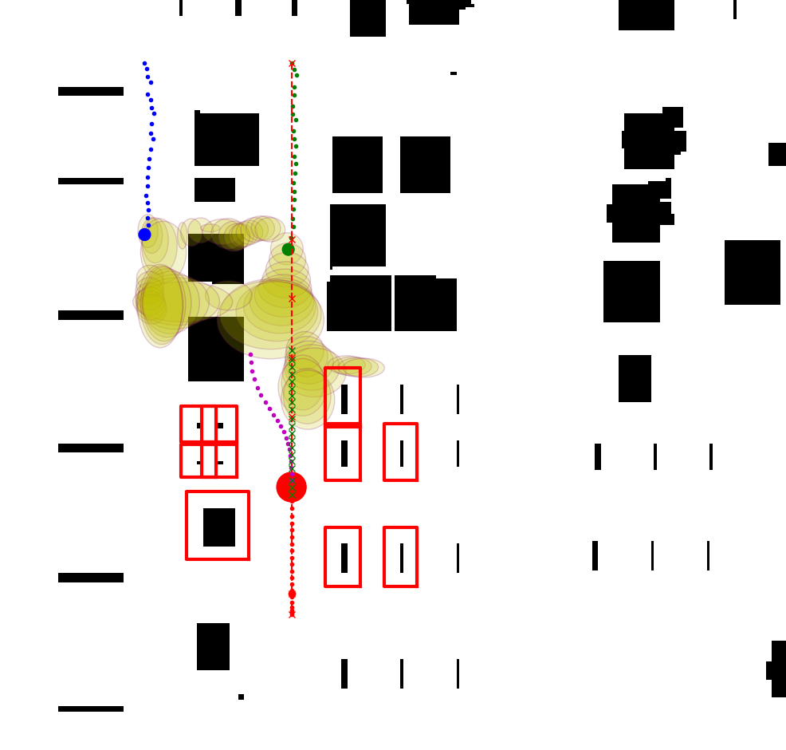

# Dynamic Obstacle Avoidance via Iterative Prediction (SWTA) and Control (MPC)
This repository contains the code to execute the simulated system for predictive dynamic obstacle avoidance based on multimodal motion prediction and model predictive control in Python. The corresponding explanation of the algorithm can be found in the paper [Prescient Collision-Free Navigation of Mobile Robots With Iterative Multimodal Motion Prediction of Dynamic Obstacles](https://ieeexplore.ieee.org/document/10185133). This paper explores safer interactions between mobile robots and dynamic obstacles and presents a comprehensive approach to collision-free navigation in indoor environments.




## Quick Start
The major interface is introduced in "doc/interface.pdf".

### 1. OpEn
The NMPC formulation is solved using open source implementation of PANOC, namely [OpEn](https://alphaville.github.io/optimization-engine/). Follow the [installation instructions](https://alphaville.github.io/optimization-engine/docs/installation) before proceeding. 

### 2. Install dependencies
It is suggested to use a virtual environment. After activating the virtual environment, install the dependencies:
```
pip install -r requirements.txt
```

### 3. Generate MPC solver
Go to "solver_build.py", use the proper configuration name **cfg_fname** and run
```
python solver_build.py
```
After this, a new directory *mpc_solver* will appear and contain the solver. Then, you are good to go :)

## Use Case
Run *main.py* for the warehouse simulation (one robot, one or more pedestrians) in Python. The evaluation is in *main_eva.py*, which compares the situation with and without the motion prediction part.


